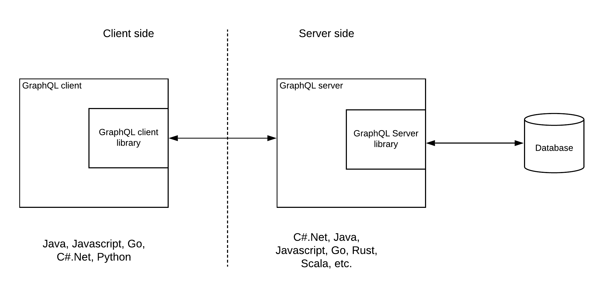
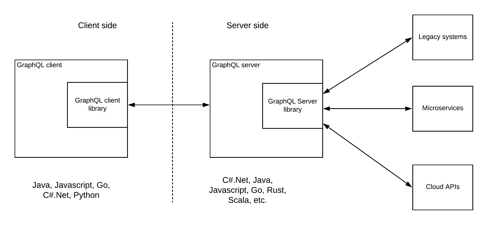
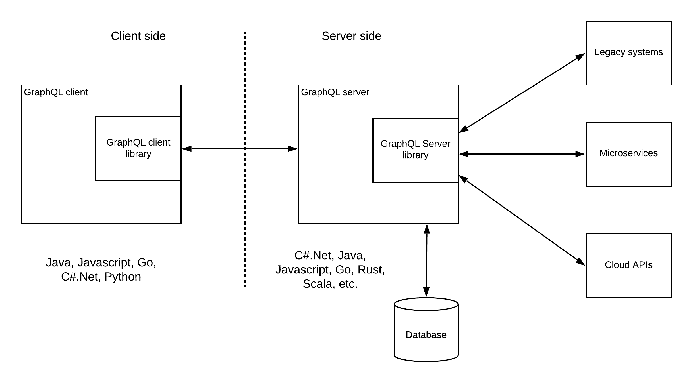
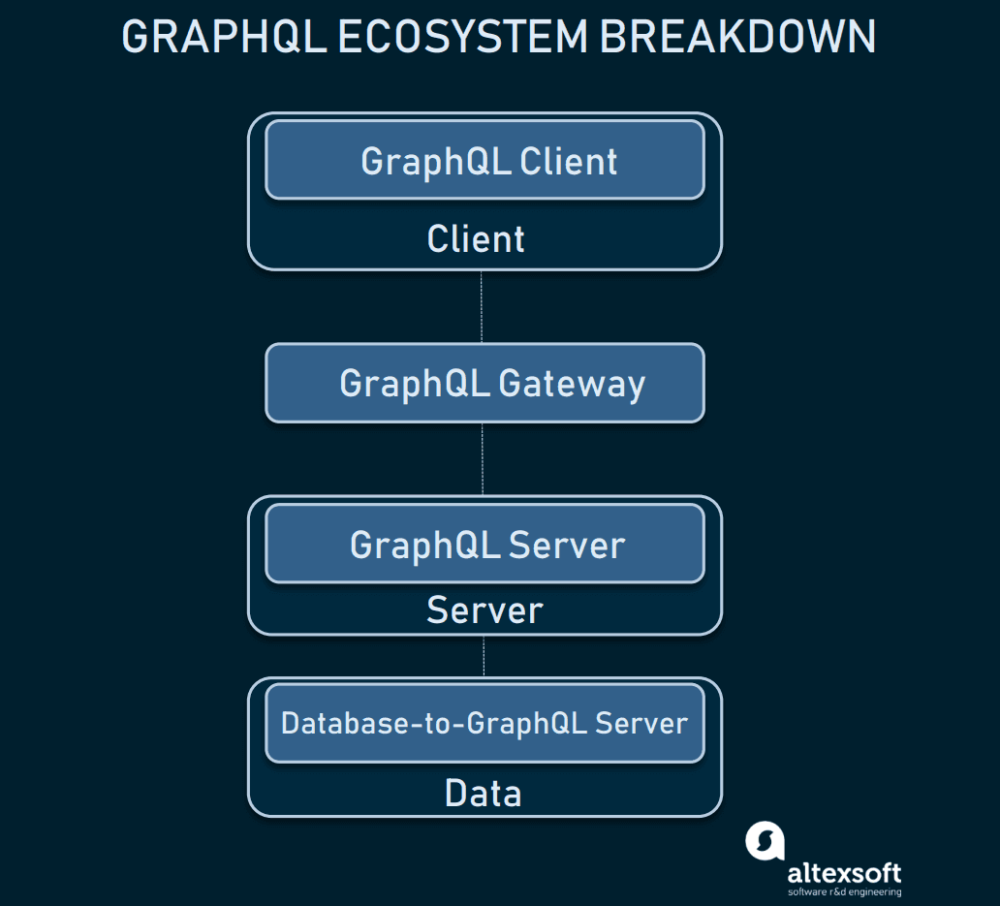

# &emsp; &emsp; &emsp; &emsp; &emsp; &emsp; &emsp; &emsp; &emsp; &emsp; &ensp; &ensp; &emsp; &emsp; &emsp; &emsp; &ensp;   **GraphQL**

&emsp; &emsp; &emsp; &emsp;&emsp;&emsp;&emsp;&emsp; &emsp; &emsp; &emsp; &emsp; &emsp; &emsp; &emsp; &emsp; &emsp; &emsp; &emsp; &emsp; &emsp; &emsp; &emsp; &ensp; &emsp; &emsp; &emsp; &emsp; &ensp; &emsp; &emsp; &emsp; &emsp; 
***Harshit Dangwal*** \
&emsp; &emsp; &emsp; &emsp; &emsp; &emsp; &emsp; &emsp; &emsp; &emsp; &emsp; &emsp; &emsp; &emsp;&emsp;&emsp;&emsp;&emsp; &emsp; &emsp; &emsp; &emsp; &emsp; &emsp; &emsp; &emsp; &ensp; &emsp; &emsp; &emsp; &emsp; *Trainee Software Engineer* \
&emsp; &emsp; &emsp; &emsp;&emsp;&emsp;&emsp;&emsp; &emsp; &emsp; &emsp; &emsp; &emsp; &emsp; &emsp; &emsp; &emsp; &emsp; &emsp; &emsp; &emsp; &emsp; &ensp; &emsp; &emsp; &emsp; &emsp; &ensp; &emsp; &emsp; &emsp; &emsp; *Mount Blue Technology* \
&emsp; &emsp; &emsp; &emsp; &emsp; &emsp; &emsp; &emsp; &emsp; &emsp; &emsp; &emsp;&emsp;&emsp;&emsp;&emsp; &emsp; &emsp; &emsp; &emsp; &emsp; &emsp; &emsp; &emsp; &ensp; &emsp; &emsp; &emsp; &emsp; *<harshit.dangwal.19.1@mountblue.tech>*

### **Abstract :**

GraphQL was developed by **Facebook** mentioning some problems about query language related to **APIs**.
GraphQL was used internally for their mobile applications to reduce network usage by means of its specific data-fetching capabilities.

so, it says *Ask for what you need,&nbsp;
get exactly that:*\
Send a GraphQL query to your API and get exactly what you need,&nbsp; nothing more and nothing less. GraphQL queries always return predictable results. Apps using GraphQL are fast and stable because they control the data they get, not the server.

*Get many resources in a single request:&nbsp;*
GraphQL queries access not just the properties of one resource but also smoothly follow references between them. While typical REST APIs require loading from multiple URLs, GraphQL APIs get all the data your app needs in a single request. Apps using GraphQL can be quick even on slow mobile network connections.

### **Introduction :**

GraphQL is a query language for APIs and a runtime for fulfilling those queries with your existing data. GraphQL provides a complete and understandable description of the data in your API, gives clients the power to ask for exactly what they need and nothing more, makes it easier to evolve APIs over time, and enables powerful developer tools.

A GraphQL server provides a client with a predefined schema – a model of the data that can be requested from the server. In other words, the schema serves as a middle ground between the client and the server while defining how to access the data.

### **GraphQL Architecture:**

GraphQL is becoming popular in the tech industry as a replacement for REST. It really carries out significant advantages over existing mechanisms for the client-server type of communications. In simple terms, GraphQL allows the client to choose which information it wants rather than receiving all the data which is available for the API. This is similar to a database query where we request only the required information. That is why it is called as GraphQL. We can do this easily with databases and data services runtime. But if you think about implementing the same capability for a REST API, you have to create so many different resources and the client has to call each and every one of these resources and handle the orchestration logic at the client-side. Otherwise, the API server has to do the heavy-lifting of orchestration. But this is not scalable with the changing demands from customers and the business.

Here we will bw discussing 3 possible solution architecture patterns that can be used to implement systems with GraphQL.

### 1. **GraphQL Server exposing database**

- This is the fundamental use case of the GraphQL. That is to expose a database in a much more controlled manner with additional capabilities like caching.

### 2. **GraphQL server exposing a database**

- This allows the GraphQL server to act as an integration hub while exposing the services through GraphQL.

### 3. **GraphQL hybrid integration**

- GraphQL hybrid integration In this pattern, GraphQL server has its own connected database and it will also connect to external systems.

### **GraphQL ecosystem**

&nbsp;

### **Conclusion**

GraphQL is designed to make APIs fast, flexible, and developer-friendly. It can even be deployed within an integrated development environment (IDE) known as GraphiQL.\
As an alternative to REST, GraphQL lets developers construct requests that pull data from multiple data sources in a single API call.  

**References** **links** \
[All About Technical Paper writing](https://www.youtube.com/playlist?list=PLgUDSV6s1CJxAmlAO-wC9H2xKPyy1nGtP) \
[GraphQL official website](https://graphql.org) \
[GraphQL: Core Features, Architecture, Pros and Cons](<https://www.altexsoft.com/blog/engineering/graphql-core-features-architecture-pros-and-cons/>) \
[GraphQL based solution architecture patterns](https://giljae.com/solution-architecture-patterns/vendor-neutral/GraphQL-Pattern.html) \
[Red hat](https://www.redhat.com/en/topics/api/what-is-graphql)
